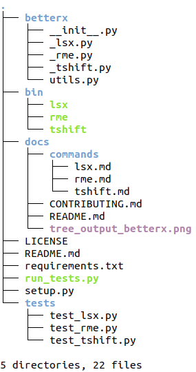

# Contributing

## Table of Contents

1. [Structuring](#structuring)
2. [Style Guide](#style-guide)
3. [Testing](#testing)
3. [Feature and Pull Requests](#feature-and-pull-requests)

### Structuring

BetterX is strcutured like most Python packages out there. You can run the `tree` command to get a high level view of the self explanatory structure - 



The `betterx` directory in the root folder contains most of the commands as functions in source code files that are preceeded by an underscore and are named after the commands themselves. For example, the `rme` function lives in the `betterx/_rme.py` file. This is the format any new command that will be incorporated will have to follow. I've tried to make BetterX commands based off of the interpreter design where ever command / statement is a method of the same name and takes roughly the same arguments (CLI args as function parameters).

To demonstrate the point, take the example of the `rme` command. The function `rme()` resides in `betterx/_rme.py` whereas the command line interface logic lives inside `bin/rme`. A few exceptions can occur as is the case with `lsx`. But for the most part, following this design leads to effective and good code.

As for tests, I follow the traditional naming conventions - all tests source code files live inside the `tests` directory and match the pattern `test_*.py`. For more info on testing, [refer this](#tests).

### Style Guide
 
I don't want to waste too much time on formatting but I have seen that it pays off in the long run. A consistent style is all I look for and I like to follow PEP-8. Along with that, I also make use of [black](https://github.com/python/black) quite a lot. To format any file, just run - 

```sh
$ black --skip-string-normalization <file_name.py>
```

black promotes double quotes over single but I disagree and hence the use of the flag `--skip-string-normalization`.

Other than that, comments are a must but a contrasting statement to that is - only use them when your code is too difficult to understand. Try to write code such that you don't even have the need for comments i.e. you can read code like English.

### Testing

I have only recently starting testing all of my code in my projects and have once again realized the importance of properly tested code only after properly incorporating them. For every new feature you develop or fix, make sure that the existing tests succeed and write new cases for the new developments.

I don't make use to fancy testing frameworks for Python although I have only praise for `nose`. But since this is not a huge project (yet), it makes used of only Python's built-in unittest package's testing suite. To run the test, make sure you're in the root directory of the project and run the `run_tests.py` script. It will automatically detect the directory `tests` and will run all the tests in Python source code files that match the pattern `test_*.py`.

### Feature and Pull Requests

Even if you're not a coder and just want a CLI tool that is generic enough but no good solutions exist outside - just [register a new issue](https://github.com/mentix02/betterx/issues/new) with the title beginning with - "feature request - " followed by a short description or heading. Fill in all the nitty grittys in the description and I'll see if it's worth spending time on.

As for pull requests, follow the same procedure as for feature request if you want to work on a new command. Make a new branch for the feature and make a request to `master`. I'll check it out and update as soon as possible. 
